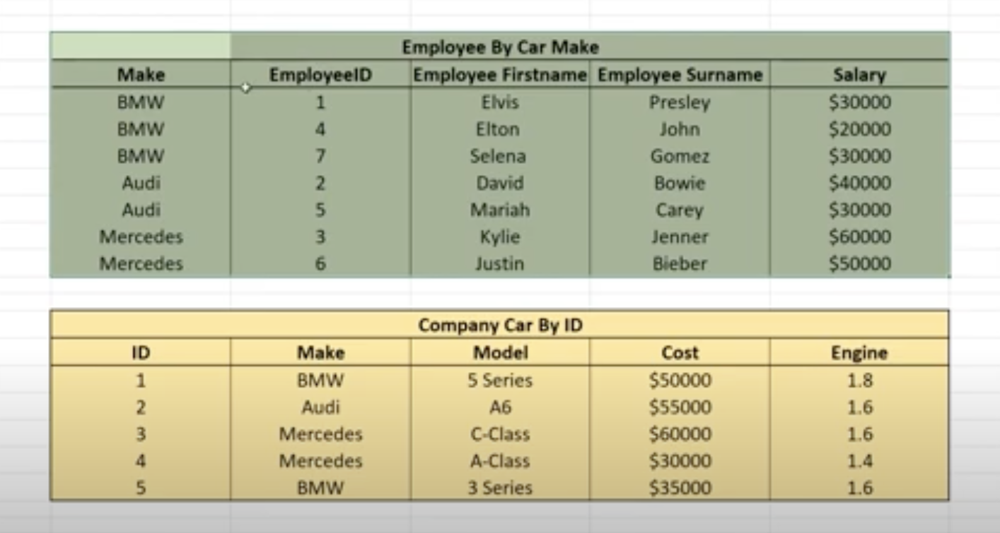

## Cassandra data model

Map<RowKey, SoredMap<colKey, colValue>>

- Cassandra takes query first approach instead relational data approach.
- Cassandra's distributed model is not very efficient as data is stored in multiple nodes performing joins require locks
  on multiple nodes.
- In cassandra we design tables for a specific query, also called query first approach.
- `Tradeoff`  
  - Designing tables using query first approach may have tradeoffs like keeping the same data in multiple locations.
- `Advantage`
  - Only one table needs to be queried, hence the high performance.

- Let's see an example of two RDBMS tables `employee` and `company car` as shown below.

- The typical queries in rdbms model for the above tables are
  - `get employees By car make:`
    - `select employee.*, company_car.make from employees join company_car on employee.CompanyCarId = company_car.id
      group by company_car.make`
  - `get company car by id`
    - `select * from company_car where id=1`

## Cassandra Query model

- In cassandra query model every column has a key and value.
- Every row also has a key. This is called `partition key`.
  - `Partition key:` Assume partition key is a like a group by value in DB.For ex, BMW, AUDI, Mercedes are partition
    keys.
    - This partition key can be used to identify the node in which data for a partition.
    - Using partition keys, we can reduce the space required. For ex, BMW is not required to be duplicated in all rows.
  
  

  
- Each column in the row has a key and value.
- Some columns may have empty values for a given row.  
  
- `Note:` When designing cassandra model, use query first approach as defined above.

## Partitioning, rings and tokens

- A query should hit as less no of partitions(nodes) as possible.
- When writing, every row of data with same partition key, should go to the same node.
  - From the above example, all the data that belongs to a single car make, should go the same node.
- Cassandra uses hash functions to generate unique values also known as tokens for identifying partition keys.
  - Range of the tokens is -263 to 263-1.
- Cassandra uses consistent hashing(virtual nodes) for assigning partition keys to a node.
  - For more information on consistent hashing, refer [Consistent Hashing](../../../problems/1.consistent_hashing/ConsistentHashing.md)
  