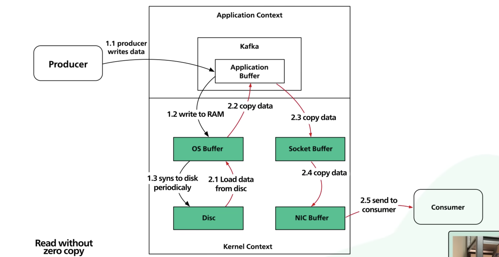
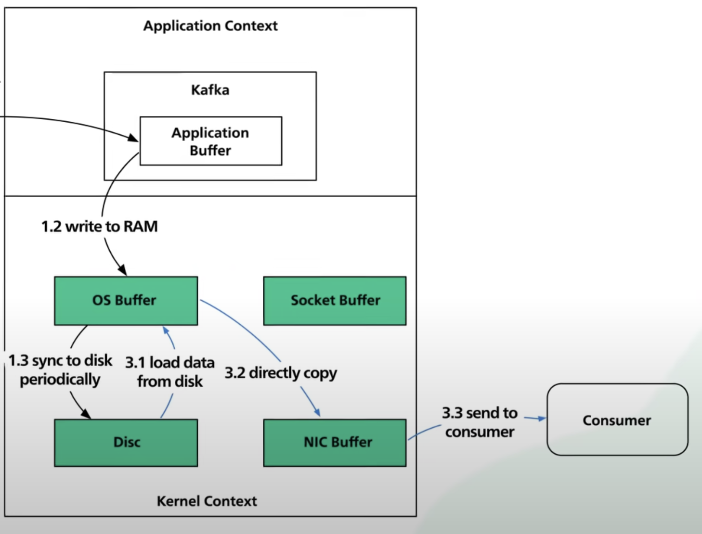

## why is kafka fast?

- Kafka is optimized for high throughput.
- It can process large no of records in short time.

### what are the design decisions for kafka's high throughput?

- There are two main decisions behind this.
  - `Data access patterns`
  - `Read With Zero copy`
  
### Data access patterns

- There is a common conception that disk access is slow compared to memory access.
- This depends on data access patterns.  
- There are two main data access patterns.
  - `Sequential I/O`
    - For sequential I/O the arm(pointer) doesn't need to jump, it is much faster to read/write data one after another.
  - `Random`
    - For hard drives it takes time to move the data because it moves the arm(pointer) physically b/w different locations.
    - This makes `Random` access slow.

#### Kafka uses SEQUENTIAL data access pattern

- Kafka uses this pattern and creates an append-only log as its primary data structure.
  - An append-only log adds new data at the end of the file.
- On modern hardware with an array of these hard disks, sequential writes reach in the order of few hundreds of MB's,
  whereas with random access pattern it is only few hundreds of KBs.
- Hard disks are 1/3rd the cost of SSD and at 3 times the capacity.
- Giving kafka a large pool of cheap disk space without compromising on performance, cost effectively retain messages
  for longer period of time.
- This was un-common for messaging systems before Kafka.

### Reading without Zero copy

- Reading without zero copy works like this.
  - Data is loaded from disk to OS buffer.
  - Data is copied from OS buffer to application buffer.
  - Data is copied from application buffer to socket buffer.
  - Data is copied from socket buffer to(Network interface card) NIC buffer.
  - Data is sent from NIC buffer to consumer.
- This is inefficient because it has 4 copies and 2 system calls.

  

### Reading with zero copy

- Modern Unix OS systems are highly optimized to transfer data from disk to network without copying excessively.
- Reading with zero copy works like this.
  - Data is loaded from disk to OS buffer.
  - Kafka application uses a system call `sendfile()` to the OS to copy data from OS buffer to NIC buffer.
  - Data is sent from NIC buffer to consumer.
- The only copy is from the OS buffer(cache) to the NIC buffer.
  - With modern `Network card` this copy is done with DMA(Direct memory access).
  - When DMA is used, cpu is not involved, which makes copy even more efficient.

## Summary

- `Sequential I/O and zero copy` are the main reasons for kafka's high performance.

