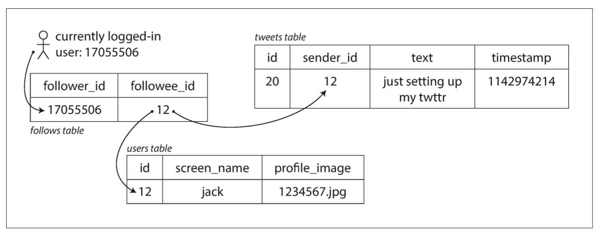
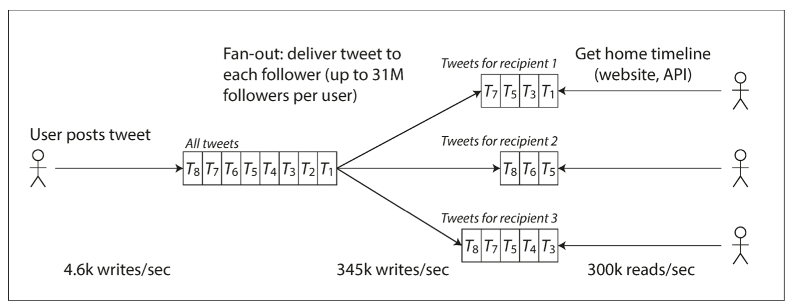

# Scalability
## Load Parameters
- Load can be described with a few numbers 
  called load parameters.These may be 
  - Requests per second to a web server, 
  - The ratio of reads to writes in a database, 
  - The number of simultaneously active users in a chat room,
  - The hit rate on a cache etc.
- Let’s consider Twitter as an example, using data published 
  in November 2012.

## Twitter use case
- The two main operations of twitter are
  - Post tweet
    - A user can publish a new message to their followers (4.
      6k requests/sec on average, over 12k requests/sec at peak).
  - Home timeline
    - A user can view tweets posted by the people they follow 
      (300k requests/sec).
- Twitter’s scaling challenge is not primarily due to tweet 
  volume, but due to fan-out. 
  - Each user follows many people, and each user is followed 
    by many people. 
- There are broadly two ways of implementing these two 
  operations:
  - Reading tweets dynamically(approach 1)
    - Posting a tweet simply inserts the new tweet into a
      global collection of tweets.When a user requests their home timeline, look up all the people they follow, find all the tweets for each of those users, and merge them (sorted by time). For ex,
```sql
SELECT tweets.*, users.* FROM tweets
JOIN users ON tweets.sender_id = users.id 
JOIN follows ON follows.followee_id = users.id 
WHERE follows.follower_id = current_user
```


  - Maintain a cache for each user’s home timeline(approach 2)
    - Like a mailbox of tweets for each recipient user.
    - When a user posts a tweet, look up all the people who 
      follow that user, and insert the new tweet into each of their home timeline caches.
    - The request to read the home timeline is then cheap, 
      because its result has been computed ahead of time.  



- The first version of Twitter used approach 1, but the 
  systems struggled to keep up with the load of home timeline queries, so the company switched to approach 2.
  - Advantage of using approach 2
    - This works better because the average rate of home 
      timeline reads is less than half of the writes, so it’s preferable to do more work at write time and less at read time.
  - Disadvantages of approach 2
    - posting a tweet now requires a lot of extra work.
    - On average, a tweet is delivered to about 75 followers, 
      so 4.6k tweets per second become 345k writes per second to the home timeline caches
    - Some users may have over 30 million followers.
    - This means that a single tweet may result in over 30 
      million writes to home timelines. This is a challenge.
- The distribution of followers per user is a key load 
  parameter for discussing scalability, since it determines the fan-out load.      

- Conclusion: Twitter uses a hybrid approach of 1 and 2. Most users tweets continue use approach 2 except for few users with very large no of followers. For those approach 1 is used.
