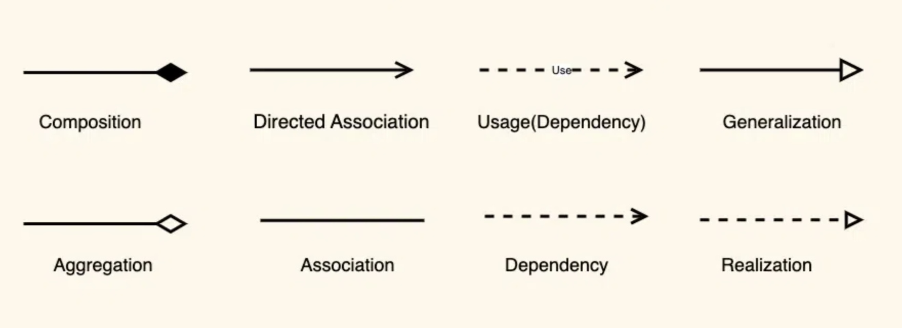
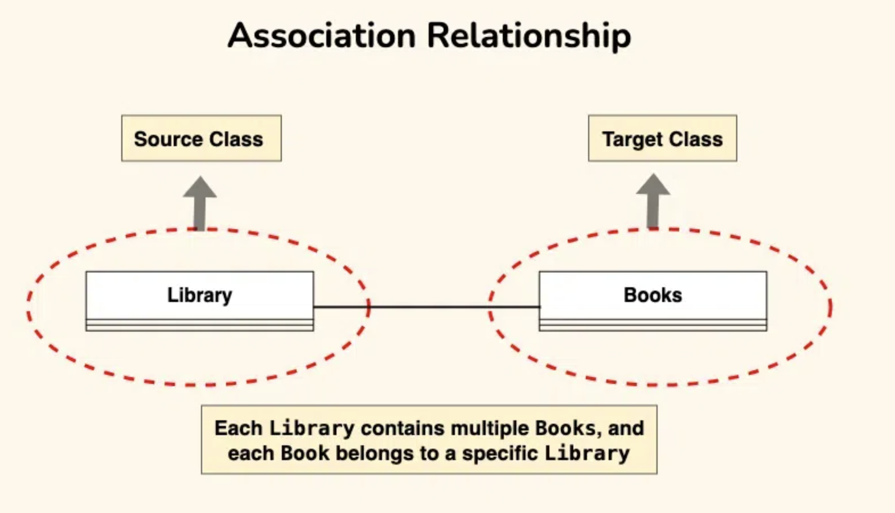
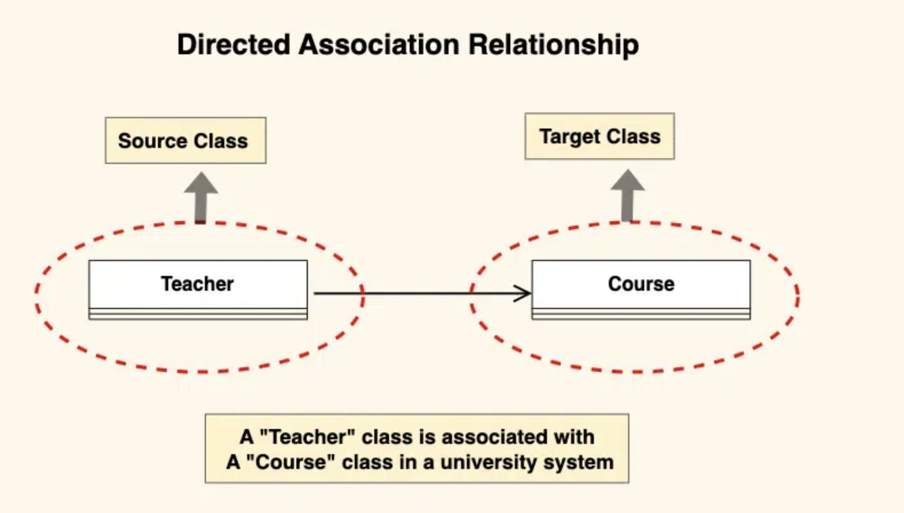
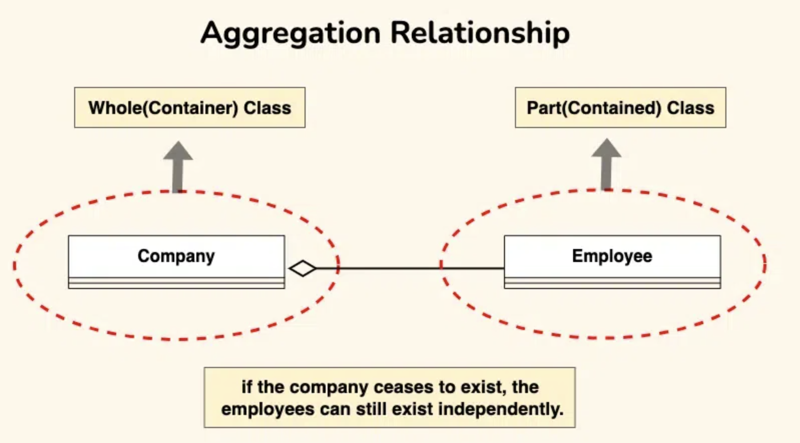
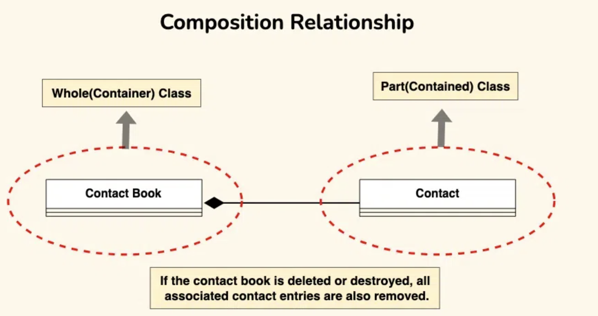
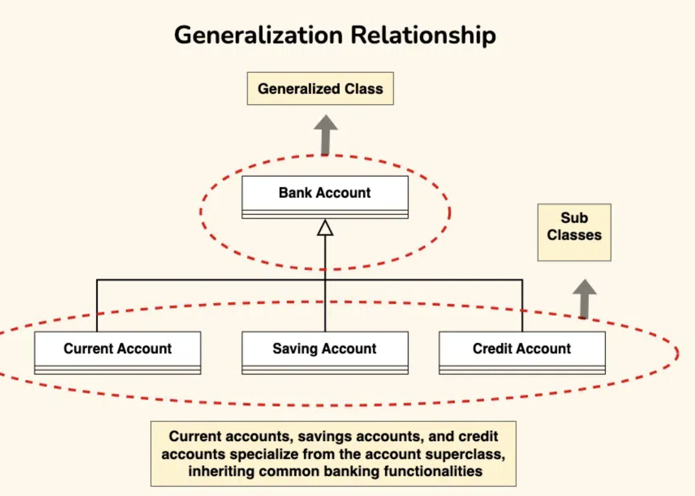
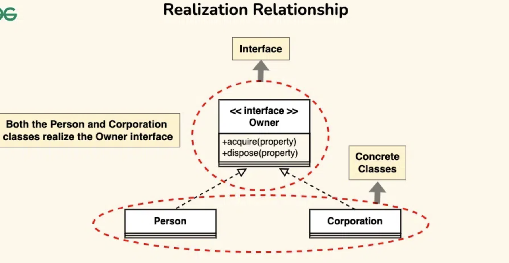
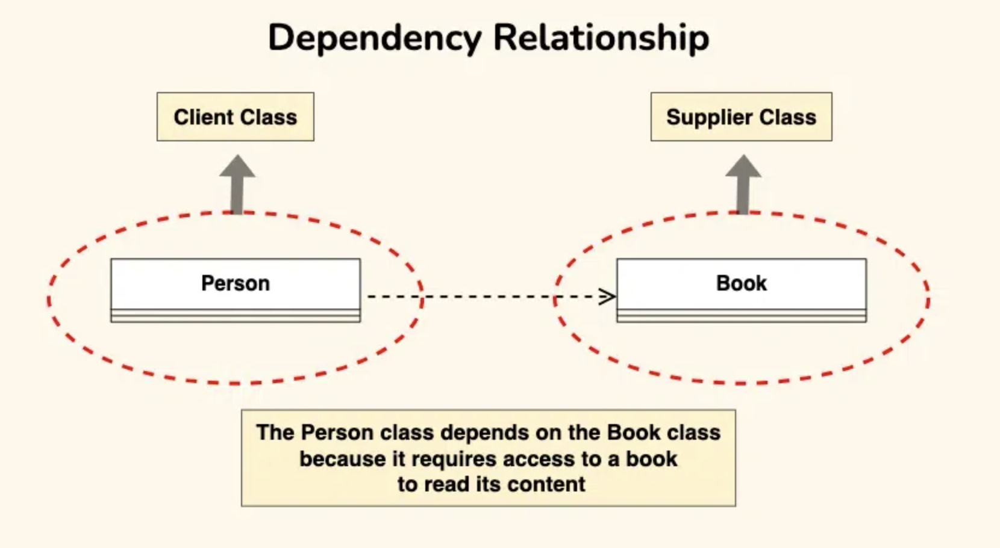

# UML
- UML stands for unified modeling language.
- It is the standard way to visualise the software design.
- It uses notations and diagrams so that it is easy to communicate between developers and architects.
- There are several types of diagrams in UML, each serving a specific purpose and capturing different 
  aspects of the system being modeled. Here are some of the most commonly used types of UML diagrams:
  - `Use Case Diagram:` Use case diagrams depict the interactions between actors (users or external systems) 
    and the system being modeled. They show the functionality provided by the system and how users interact with it to accomplish tasks.
  - `Class Diagram:` Class diagrams represent the static structure of a system by modeling classes, their 
    attributes, methods, and relationships between classes. They illustrate the logical structure of the system and the relationships between its components.
  - `Sequence Diagram:` Sequence diagrams depict the interactions between objects or components in a system 
    over time. They show the sequence of messages exchanged between objects to achieve a specific behavior or functionality.
  - `Activity Diagram:` Activity diagrams model the workflow or business processes within a system. They 
    represent the flow of activities or actions in a sequential manner, showing decision points, parallel activities, loops, and branching paths.
  - `State Machine Diagram:` State machine diagrams model the behavior of an individual object or system 
    component over time. They represent the different states that an object can be in and the transitions between these states in response to events or actions.
  - `Component Diagram:` Component diagrams represent the physical components or modules of a system and 
    their relationships. They show the high-level structure of the system in terms of reusable software components and their interactions.
  - `Deployment Diagram:` Deployment diagrams depict the physical deployment of software components onto 
    hardware nodes in a distributed system. They show how software components are deployed across different servers, nodes, or devices.
  - `Package Diagram:` Package diagrams organize and structure the elements of a system into logical 
    groupings or packages. They show the dependencies between packages and the relationships between the elements within each package.

## Class Diagram
- Class diagrams are a type of UML (Unified Modeling Language) diagram used in software engineering to 
  visually represent the structure and relationships of classes within a system.
- Classes in class diagrams are represented in boxes which contains 3 partitions as shown below.
- Class diagrams provide a high-level overview of a system’s design, helping to communicate and document the 
  structure of the software.

### UML Class Notation
- class notation is a graphical representation used to depict classes and their relationships in 
  object-oriented modeling.


- `Class Name:` The name of the class is typically written in the top compartment of the class box and is centered and bold.
- `Attributes:` These represent the data members of the class. These often include the visibility and data type of each 
  attribute.
  - `Visibility Notation`:
    - `+` for public (visible to all classes)
    - `-` for private (visible only within the class)
    - `#` for protected (visible to subclasses)
    - `~` for package or default visibility (visible to classes in the same package)
  - `Methods:`
    - These represent the behavior or functionality of the class. These also include visibility and parameter directionality.
    - `Parameter Directionality`
      - There are three types of notations In, Out and InOut.

### Relationships between classes
- Relationship between classes define how classes are connected and interact with each other within a system. There are several types of relationships in object-oriented modeling, each serving a specific purpose.



#### Association
- An association represents a bi-directional relationship between two classes.
- Associations are typically depicted as a solid line connecting the classes.
- For ex, a library system has two main entities Book and Library.
  - A Library contains books and A Book is associated to a library.
- In an association, both classes are considered equal, and neither class owns the other. Objects of each class can exist 
  independently of each other.  



#### Directed Association
- It represents a relationship between two classes where the association has a direction, indicating that one class is 
  associated with another in a specific way.
- Consider a scenario where a `Teacher` class is associated with a `Course` class in a university system.
- `Note:` A `Course` is not associated to a `Teacher`.



#### Aggregation
- Aggregation is a special form of association where one class (the whole or aggregate) contains or owns objects of another 
  class (the part or child).
- Aggregation implies a "whole-part" relationship, where the part can exist independently of the whole.
- Aggregation is represented by a diamond shape on the side of the whole class.



#### Composition
- Composition is a stronger form of aggregation, indicating a more significant ownership or dependency relationship.
- In composition, the part class cannot exist independently of the whole class.
- Composition is represented by a filled diamond shape on the side of the whole class.
- Let's consider the contact book.
  - The contact book is the whole, and each contact entry is a part. 
  - Each contact entry is fully owned and managed by the contact book.
  - If the contact book is deleted or destroyed, all associated contact entries are also removed.



#### Generalization(Inheritance)
- Inheritance represents an `is-a` relationship between classes.
- Inheritance is depicted by a solid line with a closed, hollow arrowhead pointing from the subclass to the superclass.
- In the example of bank accounts, we can use generalization to represent different types of accounts such as current 
  accounts, savings accounts, and credit accounts.



#### Realization(Interface Implementation)
- Realization indicates that a class implements the features of an interface.
- Realization is depicted by a dashed line with an closed, hollow arrowhead pointing from the implementing class to the 
  interface.
- Let’s consider the scenario where a “Person” and a “Corporation” both realizing an “Owner” interface.
  - `Owner Interface:` This interface now includes methods such as “acquire(property)” and “dispose(property)” to represent 
    actions related to acquiring and disposing of property.
  - `Person Class (Realization):` The Person class implements the Owner interface, providing concrete implementations for the 
    “acquire(property)” and “dispose(property)” methods. For instance, a person can acquire ownership of a house or dispose of a car.
  - `Corporation Class (Realization):` Similarly, the Corporation class also implements the Owner interface, offering specific 
    implementations for the “acquire(property)” and “dispose(property)” methods. For example, a corporation can acquire ownership of real estate properties or dispose of company vehicles.



#### Dependency
- A dependency exists between two classes when one class relies on another, but the relationship is not as strong as association or inheritance.
- It represents a more loosely coupled connection between classes.
- Dependencies are often depicted as a dashed arrow.
- Let’s consider a scenario where a Person depends on a Book.
  - `Person Class:` The Person class depends on the Book class to access and read the content.
  - `Book Class:` The Book class is independent and can exist without the Person class.
- Dependency is the weakest form of relationship, and it does not imply any ownership or direct association between classes.



#### Usage(Dependency)
- Usage represents a stronger form of dependency where one class utilizes the services or functionality provided by another 
  class.
- It implies a more direct and intentional relationship where one class actively uses or interacts with another class.
- Usage is often used to model temporary or runtime relationships between classes
- Usage dependencies are typically represented by a dashed arrowed line pointing from the client class to the supplier class.

## When to use what?

- `Association:`
  - Use association to represent a general relationship between two classes where objects of one class are related to objects 
    of another class.
  - Use association when the relationship between classes is long-lived and has a significant impact on the design and 
    structure of the system.
  - Use association when both classes are equal partners in the relationship, and neither class owns the other.
  - Examples of association include "has-a" relationships, such as a car having an engine or a department having employees.
```java
public class Order {
    private Customer customer; // Directed association from Order to Customer
}

public class Customer {
    // Attributes and methods
}
```
- `Usage:`
  - Use usage to represent a stronger form of dependency where one class actively uses or interacts with another class.
    Use usage when one class relies on the services or functionality provided by another class, but the relationship is temporary or runtime-specific.
  - Use usage when the dependency is more direct and intentional, and one class actively utilizes the functionality provided 
    by another class.
  - Examples of usage include a class using a utility class to perform specific tasks or a class using a library to access 
    external functionality.
```java
public class ShoppingCart {
    private List<Item> items; // ShoppingCart class uses the Item class
}
```
- `Dependency:`
  - Use dependency to represent a weaker form of relationship where one class depends on (uses) another class in some way.
  - Use dependency when one class relies on the existence or behavior of another class, but the relationship is more indirect 
    and non-specific.
  - Use dependency when a change in one class could potentially affect the other class, but there is no direct association or 
    ownership between them.
  - Examples of dependency include a class importing or referencing another class to access its functionality or a class 
    relying on external resources or configurations.
```java
public class Car {
    public void start() {
        Engine engine = new Engine(); // Car class depends on Engine class
        engine.start();
    }
}

public class Engine {
    public void start() {
        // Start the engine
    }
}
```

## Multiplicity

- Multiplicity is a concept used in class diagrams to indicate the number of instances of one class that are related to the 
  instances of another class in an association or relationship.
- `Multiplicity Notation:`
  - Multiplicity is represented using numbers or range expressions placed near the ends of an association line connecting two 
    classes.
  - `0:` Zero indicates that no instances of the associated class are required. It represents an optional relationship.
  - `1:` One indicates that exactly one instance of the associated class is required. It represents a mandatory relationship.
  - `*:` (asterisk): Asterisk indicates that any number of instances (zero or more) of the associated class are allowed.
  - `Range expressions` (e.g., 1..3, 3..10) specify a range of valid multiplicity values, indicating a minimum and maximum 
    number of instances.
  - `Examples:`
    - `0..1`: Zero or one instance of the associated class.
    - `1`: Exactly one instance of the associated class.
    - `0..*`: Zero or more instances of the associated class.
    - `1..*`: One or more instances of the associated class.
    - `3`: Exactly three instances of the associated class.
    - `1..3`: Between one and three instances of the associated class.
    - `2..4`: Between two and four instances of the associated class.
- Here is a sample diagram which explains various relations.
  - `Generalization:` A Teacher is an Employee or inherited from Employee.
  - `Association:` A Teacher is associated with a subject.
  - `Aggregation:` A Teacher can belong to a Department. A Teacher can exist without Department also. 
  - `Composition:` A Dept manager belongs to one Department. A Dept manager cannot exist without Department.
    - Multiplicity is `1..1` or can simply write `1`.
  - `Composition:` A teacher belongs to a class. A Teacher cannot exist(or teach) without a Class.
    - Multiplicity is `1..*` because a Teacher can teach multiple classes.
    
