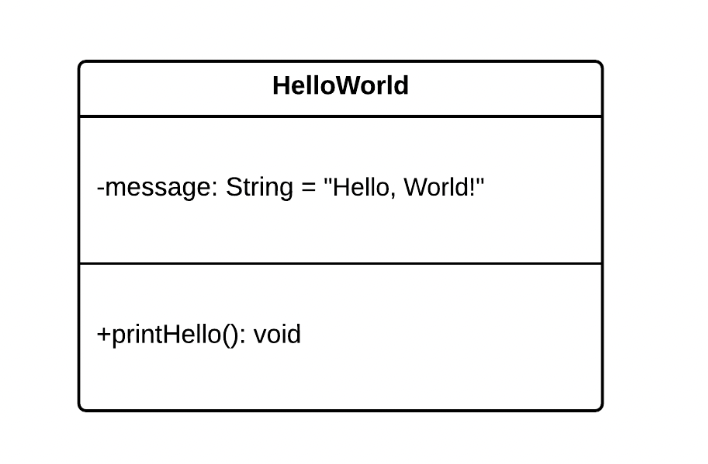

# Class Diagrams - Basic Concepts

- UML Class Diagrams consists of three sections: the class name, attributes, and operations.
  - `Class names` are written in bold.
    - Abstract class names are written in italics.
  - Static attributes and operations are underlined.
  - `Attributes` refer to the properties, or fields, or a class. They are expressed as follows:
    - `<visibility><name>: <type> = <default value> <{modifier}>`
      - `Visibility` refers to the access modifiers on the attributes, and UML supports the following access 
        modifiers (relate them back to the programming language in which you will write your code):
        - `+` (public)
        - `-`  (private)
        - `~` (package)
        - `#` (protected)
      - The `name` of an attribute is used to identify the attribute.
      - The `type` of the attribute refers to the data type that it will use (String, Integer, etc.).
      - The `default value` of an attribute is optional, and may be left blank.
      - The `modifier` is optional, and serves to provide additional information on the attribute, such as 
        {readOnly}.
  - `Operations` refer to the behaviours, or methods of a class. They are expressed as follows:
    - `<visibility><name>(<parameter list>): <return type>`
      - `Visiblity and name` are self-explanatory - they serve the same purpose as they do on attributes.
      - The `parameters` refer to the parameters (or method arguments) that will be passed to the operation when 
        it is invoked.  They are represented as follows: 
        - `<parameter name>: <parameter type>`.
      - The `return type` refers to the type of the result returned by the operation, such as String or Integer (or void, if it does not return anything).



- Expressed in Java code, the class above looks like this.
```java
public class HelloWorld {
 
    private String message = "Hello, World!";
 
    public void printHello() {
        System.out.println(message);
    }
}
```