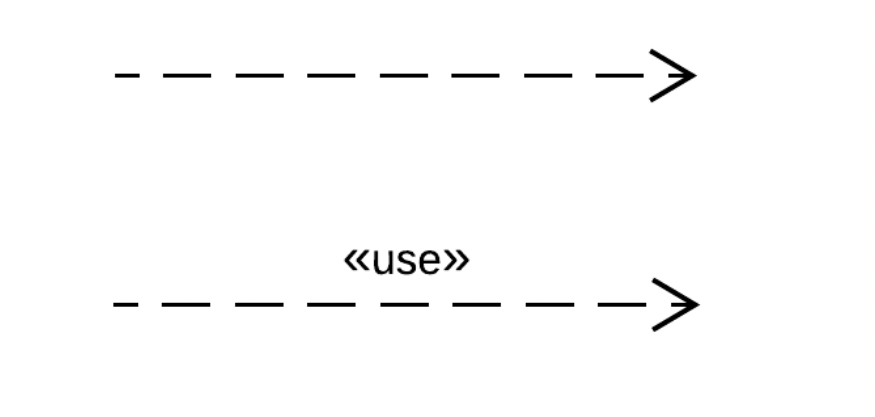
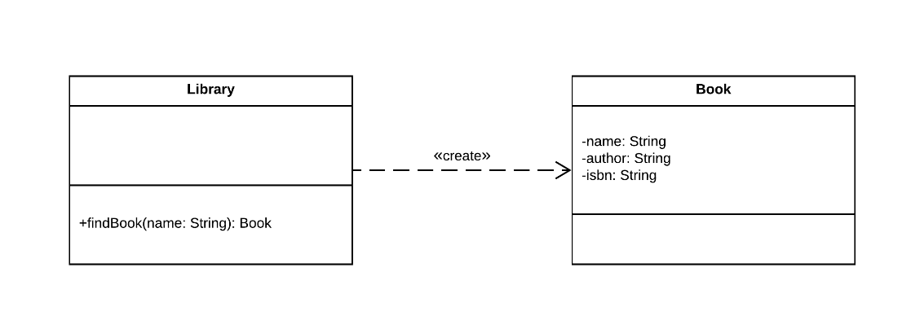
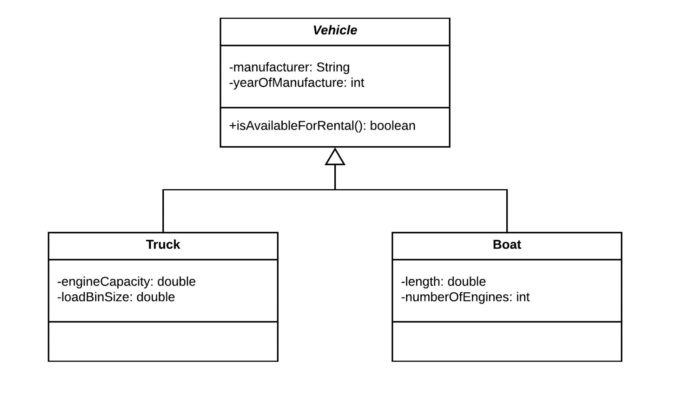
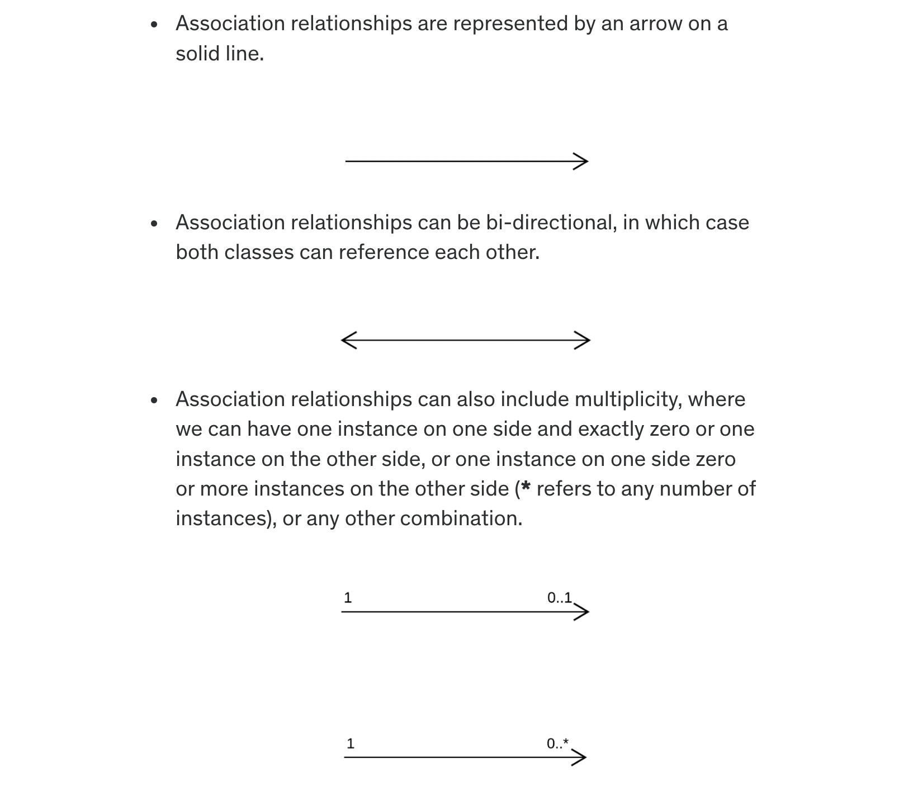
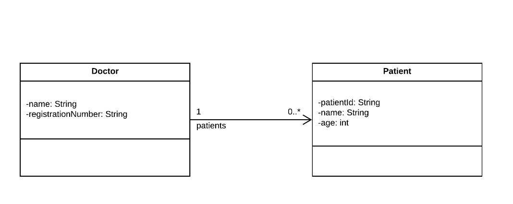
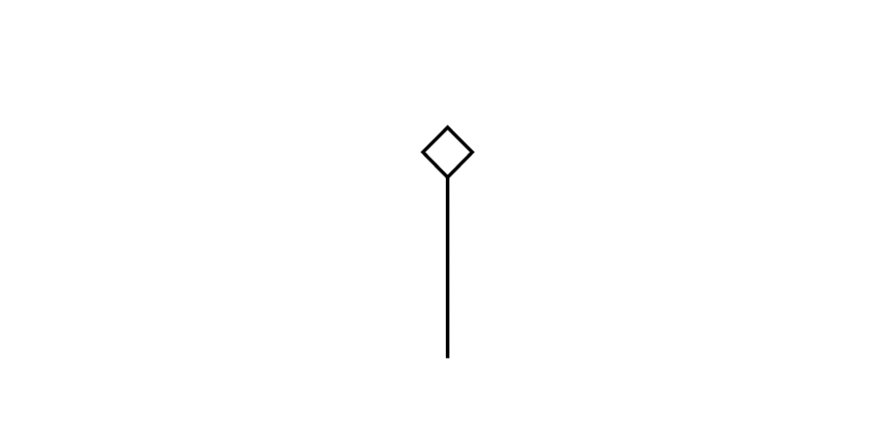
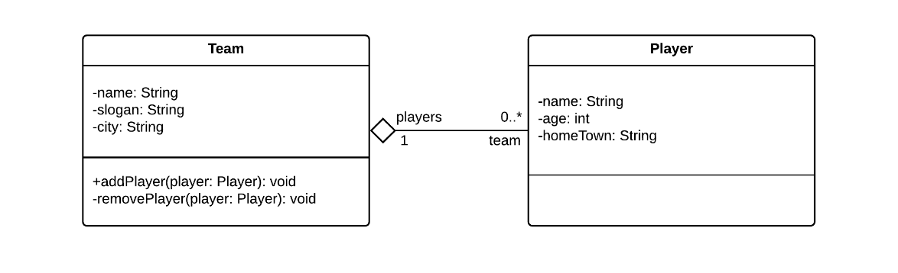

# Class Diagrams - Relationships

- Object-oriented classes have relationships between them - they extend each other (inheritance), they depend on each other 
  (dependency), they interact with each other (association), or they form part of each other (aggregation and composition).
- Relationships also have multiplicity, which shows how many instances of a class can exist on each side of a relationship.

## Dependency
- Dependency relationships exist when classes depend on each other in such a way that a change to one class may affect the 
  other, such as when one class invokes method of another class or when one class accepts an instance of another class as parameter to a method.
- Dependency relationships are represented by arrows on dashed lines.  Stereotypes can be indicated within guillemets(double 
  angular brackets) to provide further detail on the nature of the relationship.



- A dependency relationship can exist when we have a Library class that manages Book objects. Since the Library class has a method that returns a Book, changes to the Book class could result in changes to the Library class (based on how Book objects are created).



```java
public class Library {
 
    public Book findBook(String name) {
        //Do some book stuff.
        return new Book(name, author, isbn);
    }
}
 
class Book {
 
    private String name;
    private String author;
    private String isbn;
 
    //Getters/setters omitted.
}
```
- From the above code it is evident that a change in Book constructor(adding another property) requies a change in 
  findBook() of Library.

## Generalization
- Generalization relationships exists when one class extends another class (making it a specialization of the parent class, 
  like a Car is a specialization of a Vehicle).
- Generalization relationships are represented by a triangular arrow on a solid line.


- Operations and attributes on the parent class also exist on the child classes, without being explicitly specified.
- A generalization relationship can exist when we have a system that keeps track of vehicle rentals, where we have various specialized vehicles.



- `Note`: Vehicle is an abstract class and is mentioned in italic.
- Expressed in code, these classes look like this.

```java
public abstract class Vehicle {
 
    private String manufacturer;
    private int yearOfManufacture;
 
    public String getManufacturer() {
        return manufacturer;
    }
 
    public void setManufacturer(String manufacturer) {
        this.manufacturer = manufacturer;
    }
 
    public int getYearOfManufacture() {
        return yearOfManufacture;
    }
 
    public void setYearOfManufacture(int yearOfManufacture) {
        this.yearOfManufacture = yearOfManufacture;
    }
 
    public boolean isAvailableForRental() {
        //Execute some logic.
        return true;
    }
}
 
class Truck extends Vehicle {
 
    private double engineCapacity;
    private double loadBinSize;
 
    public double getEngineCapacity() {
        return engineCapacity;
    }
 
    public void setEngineCapacity(double engineCapacity) {
        this.engineCapacity = engineCapacity;
    }
 
    public double getLoadBinSize() {
        return loadBinSize;
    }
 
    public void setLoadBinSize(double loadBinSize) {
        this.loadBinSize = loadBinSize;
    }
}
 
class Boat extends Vehicle {
 
    private double length;
    private int numberOfEngines;
 
    public double getLength() {
        return length;
    }
 
    public void setLength(double length) {
        this.length = length;
    }
 
    public int getNumberOfEngines() {
        return numberOfEngines;
    }
 
    public void setNumberOfEngines(int numberOfEngines) {
        this.numberOfEngines = numberOfEngines;
    }
 
    public static void main(String[] args) {
        Boat boat = new Boat();
        boat.setManufacturer("Boat Company");
        boat.setYearOfManufacture(2018);
        boat.setLength(5.5);
        boat.setNumberOfEngines(2);
 
        Vehicle vehicle = boat;
    }
}
```

## Association

- Association relationships often exist when classes have variables of other types, that they can invoke operations on.
- Association is different from `dependency` because with association one class is coupled to another class.



- An association relationship can exist when we model the relationship between doctors and patients, where a doctor can have 
  any number of patients and a patient can only be treated by one doctor at a time.



- If we express this diagram in code, it looks like this.

```java
public class Doctor {
 
    private String name;
    private String registrationNumber;
    private List<Patient> patients = new ArrayList<Patient>();
 
    public void addPatient(Patient patient) {
        this.patients.add(patient);
    }
 
    //Getters/setters omitted.
}
 
class Patient {
 
    private String patientId;
    private String name;
    private int age;
 
    //Getters/setters omitted.
}
```

## Aggregation

- Aggregation relationships exist when we aggregate (or bring together) objects of one class in another class.
- Aggregation relationships represent whole-part relationships.
- Aggregation relationships are represented by an unfilled diamond on the 'owning' side of the relationship.



- Objects on both sides of an aggregation relationship can exist in isolation.  
- Aggregation relationships can have multiplicity.
- An aggregation relationship can exist when we model teams and players. A player can exist without belonging to a team, and 
  a team can exist without any players.

  

- In code, our example looks like this.
```java
public class Team {
 
    private String name;
    private String slogan;
    private String city;
 
    private List<Player> players = new ArrayList<>();
 
    //Getters/setters omitted.
 
    public void addPlayer(Player player) {
        this.players.add(player);
        player.setTeam(this);
    }
 
    public void removePlayer(Player player) {
        this.players.remove(player);
        player.setTeam(null);
    }
}
 
class Player {
 
    private String name;
    private int age;
    private String homeTown;
 
    private Team team;
 
    //Getters/setters omitted.
 
    public void setTeam(Team team) {
        this.team = team;
    }
}
```
- The above code indicates the relationship is bi-directional, because `Player` class also holds reference to `Team`.
- When the code is bi-direction, need to keep both side of the relation in sync. So, it is always better to update `Player` 
  class from `Team` class.
  - `Note`: Some developers can write code to interact with `Team` from `Player`. This could lead to out of sync. So, need 
    to avoid this.

## Composition

- Composition relationships when objects are composed of (or made up of) other objects.
- Composition relationships are represented by a filled diamond on the 'owning' side.


- Objects in a composition relationship cannot, conceptually, exist in isolation.
  - `Note`: This isn't always easy to enforce in code. Some examples with nested classes for ex composite primary key in JPA.
- If the parent object in a composition relationship is destroyed, so are the child objects.
- A composition relationship can exist when we model a system for creating web pages - pages cannot exist without a page 
  header and a page body, and each PageHeader and PageBody object must belong to a WebPage object.
- If we express the WebPage model above in code, it could look like this.

```java
public class WebPage {
 
    private final PageHeader header;
    private final PageBody pageBody;
 
    public WebPage(PageHeader header, PageBody pageBody) {
        this.header = header;
        this.pageBody = pageBody;
    }
}
 
class PageHeader {
 
    private String title;
    private String charset;
 
    //Getters/setters omitted.
}
 
class PageBody {
 
    private String body;
 
    //Getters/setters omitted.
}
```