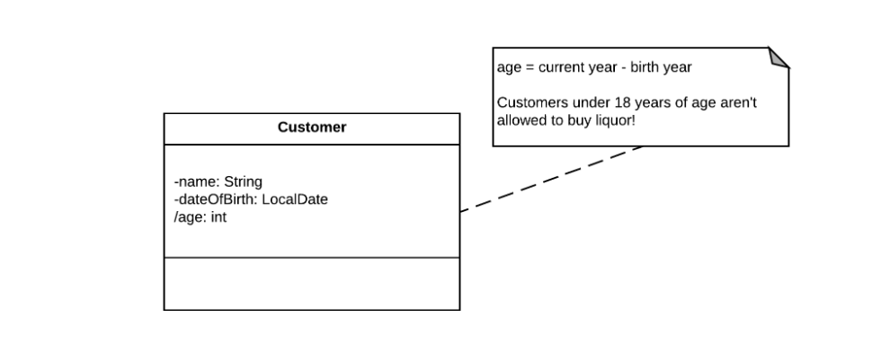
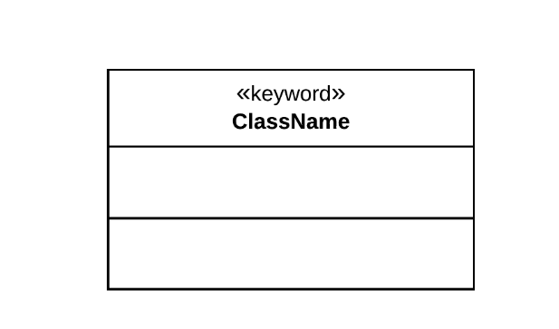
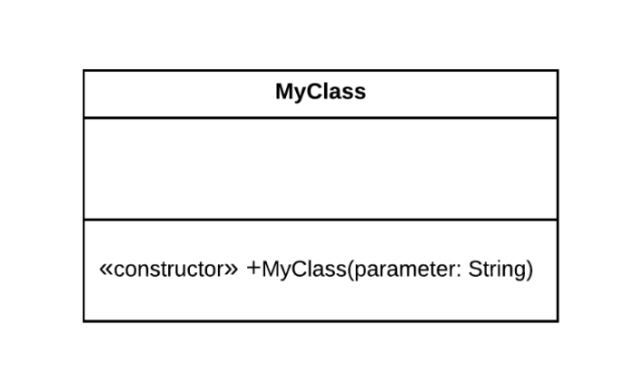
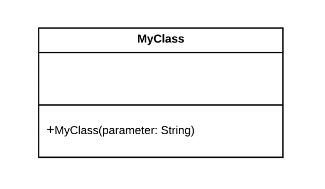

# Advanced Concepts

## Notes
- `Notes` are used to add additional information to UML Class Diagrams (and other UML diagrams).
- `Notes` are represented by a rectangle with the top-right corner folded over.
- `Notes` can exist on the diagram itself, or they can be linked to specific elements with a dashed line.


## Template Classes(Generics)

- Template classes are parameterized to operate on specific types.
- Template classes are represented by a generic type in a dashed block on the top-right corner of the class.
- Template classes correspond to generic classes in languages like Java and C#.
- A template class can be used to represent a Container class that can hold objects of a specific type.


## Derived Attributes
- Derived attributes are class attributes that can be calculated based on other values on a class (or outside of it, such as 
  the current date).
- Derived attributes are indicated by a forward slash (/) preceding the attribute name (e.g. /age: int ).
- We can use notes to indicate how derived attributes are calculated (although we could also show this on a sequence- or 
  activity diagram).
- We can use a derived attribute to model a class that calculates a customer's age.



- In code, our derived attribute could be calculated as follows.
```java
public class Customer {
 
    private final String name;
    private final LocalDate  dateOfBirth;
 
    private final int age;
 
    public Customer(String name, LocalDate dateOfBirth) {
        this.name = name;
        this.dateOfBirth = dateOfBirth;
 
        LocalDate now = LocalDate.now();
 
        this.age = now.getYear() - dateOfBirth.getYear();
    }
 
    //Getters omitted.
 
}
```

## Keywords

- Keywords are used to provide additional metadata on a class or class element.
- Keywords on a class (the ones that we use in this course) are indicated in guillemets.



## Constructors

- Constructors are special operations used to create instances of a class.
- Constructors share the name of the class and do not specify a return type.
- Constructors can be indicated with the 'constructor' keyword.



- Constructors can also be indicated without the 'constructor' keyword, since one can easily infer that an operation is a
  constructor.

