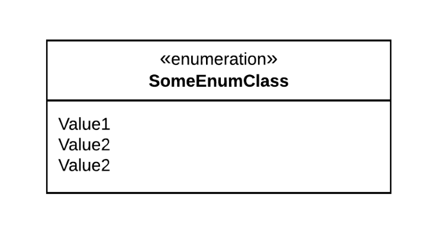

# Interfaces

- Interfaces define contracts for behaviour, but without implementing that behaviour.
- Interfaces are realized (or implemented) by concrete classes.
- Interfaces are indicated by the 'interface' keyword.
- Realization is shown with a triangle on a dashed line.
- Interface methods are implicitly included on classes that realize an interface, even if they are not shown.

 # Enumerations

- Enumerations, or enums, are classes that provide a fixed set of literal values.
- Enums are indicated by the 'enumeration' keyword.
- Enums provide attributes (values), but generally do not provide behaviour, so they can be drawn without the operations 
  section.
- Enums do not need to show attribute types, since all attributes are of the type of the enum itself.
- Enums also do not need to show access modifiers, since all attributes are implied to be accessible if the enum itself is 
  accessible.

