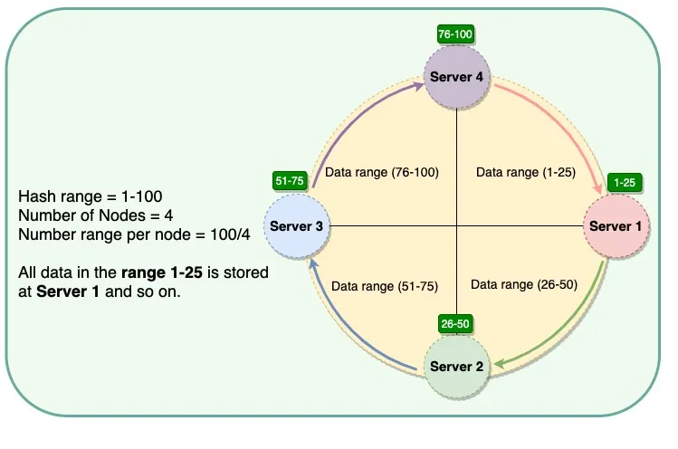
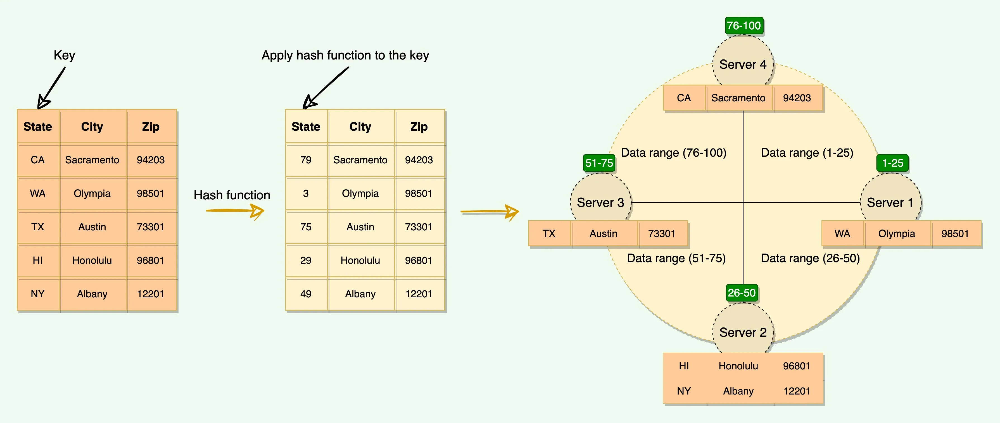
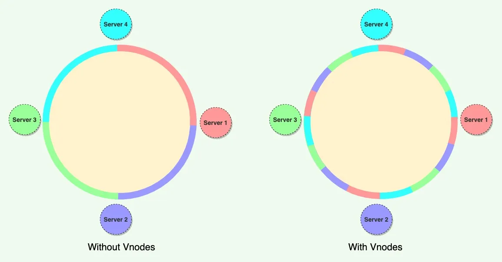
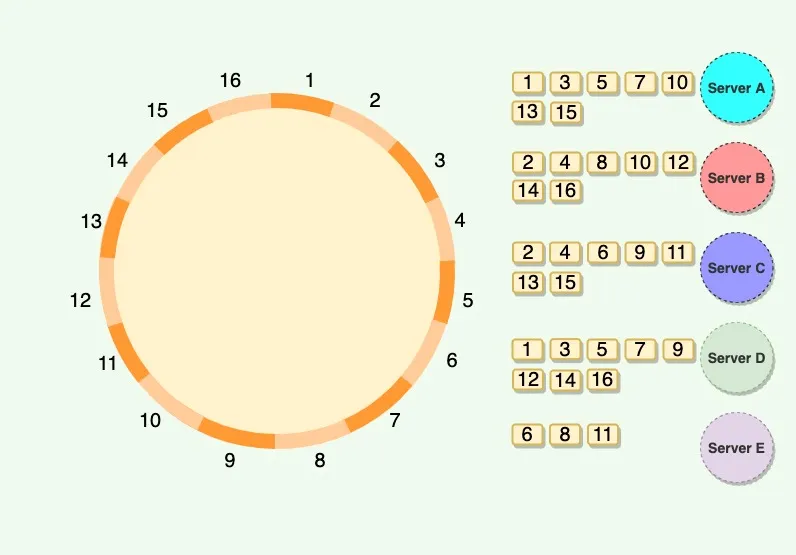

# Consistent Hashing

## Hash Functions

- Hash Functions are any functions that map value from an arbitrarily sized domain to another 
  fixed-sized domain.
  - For example, mapping URLs to 32-bit integers or web pages’ HTML content to a 256-byte string.
- The values generated as an output of these hash functions are typically used as keys to enable efficient lookups of the original entity.
- An example of a simple hash function is a function that maps a 32-bit integer into an 8-bit integer hash space.
  - The function could use a simple module operator or can use more efficient algorithms like MD5, SHA etc.
- A good hash function has the following properties.
  - The function is computationally efficient and the values generated are easy for lookups.
  - The function, for most general use cases, behaves like a pseudorandom generator that spreads
    data out evenly without any noticeable correlation.

## What is consistent hashing
- Consistent hashing is a very useful strategy for distributed systems.
- It allows us to distribute data across a cluster in such a way that will minimize reorganization when nodes are added or removed.
- In Consistent Hashing, when the hash table is resized, only ‘k/n’ keys need to be remapped where ‘k’ is the total number of keys and ‘n’ is the total number of servers.
  - When a host is removed from the system, the objects on that host are shared by other hosts.
  - when a new host is added, it takes its share from a few hosts without touching other’s shares.

## How does it work?
- Consistent Hashing stores the data managed by a distributed system in a ring. 
- Each node in the ring is assigned a range of data. Here is an example of the consistent hash ring:



- Whenever the system needs to read or write data, the first step it performs is to apply the 
  MD5/SHA or any custom hashing algorithm to the key.
- The output of this hashing algorithm determines the range in which the data lies.
  - It internally uses Binary search tree(BST) to choose a node.
- Thus, the hash generated from the key tells us the node where the data will be stored.



- Consistent Hashing algorithm assigns a consecutive hash range to each physical node.
- This was a static division of ranges based on a given number of nodes.
- Here are a few potential issues associated with a manual and fixed division of the ranges:
  - `Adding or removing nodes:` Adding or removing nodes will result in recomputing the tokens causing a significant administrative overhead for a large cluster.
  - `Hotspot:` Since each node is assigned one large range, some nodes can become hotspots if the data is not evenly distributed.
  - `Node rebuilding:` Since each node’s data might be replicated on a fixed number of other nodes, rebuilding a node puts lot of pressure on the replica nodes.

## Virtual nodes

- To handle the issues with Consistent Hashing introduces the concept of virtual nodes, a new scheme of distributing the data to physical nodes.
- Instead of assigning a single consecutive range to a node, the hash range is divided into multiple smaller ranges, and each physical node is assigned several of these smaller ranges. 
- Each of these subranges is considered a Vnode.
- With Vnodes, instead of a node being responsible for just one range, it is responsible for many sub-ranges.



- Vnodes are randomly distributed across the cluster and are generally non-contiguous so that no two neighboring Vnodes are assigned to the same physical node.
- Additionally, nodes do carry replicas of other nodes for fault tolerance.
- since there can be heterogeneous machines in the clusters, some servers might hold more Vnodes than others.
- The figure below shows how physical nodes A, B, C, D, & E use Vnodes. Each physical node is assigned a set of Vnodes, and each Vnode is replicated once.



## Advantages of Vnodes

- Vnodes help spread the load more evenly across the physical nodes on the cluster by dividing the hash ranges into smaller subranges.
  - When a new node is added, it receives many Vnodes from the existing nodes to maintain a balanced cluster.
  - when a node needs to be rebuilt, instead of getting data from a fixed number of replicas, many nodes participate in the rebuild process.
- Vnodes make it easier to maintain a cluster containing heterogeneous machines. 
  - we can assign a high number of sub-ranges to a powerful server and a lower number of sub-ranges to a less powerful server.
- Decreases the possibility of hotspots.

```java
public class ConsistentHashing {
  private final TreeMap<Long, Pair<String, List<String>>> ring;
  private final int ringSize;
  private final int noOfVirtualNodes;
  private final int noOfReplicas;

  private final MessageDigest md;

  public ConsistentHashing(int noOfVirtualNodes, int noOfReplicas) throws NoSuchAlgorithmException {
    this.ring = new TreeMap<>();
    this.noOfVirtualNodes = noOfVirtualNodes;
    this.noOfReplicas = noOfReplicas;
    this.md = MessageDigest.getInstance("MD5");
    this.ringSize = 1024;
  }

  public void addServer(String server) {
    for (int i = 0; i < noOfVirtualNodes; i++) {
      for(int j = 0; j < noOfReplicas; j++){
        // All virtual nodes with replica 0 is master virtual node
        // Generates different hash values for each virtual node and replica
        long hash = generateHash(server + i, j);
        Pair<String, List<String>> dataMap = new Pair<>(server, new ArrayList<>());
        ring.put(hash, dataMap);
      }
    }
  }

  public void removeServer(String server) {
    for (int i = 0; i < noOfVirtualNodes; i++) {
      // Server with 0 replica id is master virtual node
      for(int j = 0; j < noOfReplicas; j++) {
        long hash = generateHash(server + i, j);
        ring.remove(hash);
      }
    }
  }

  public String getServer(String key) {
    if (ring.isEmpty()) {
      return null;
    }
    long hash = generateHash(key, 0);
    if (!ring.containsKey(hash)) {
      // SortedMap<Long, String> tailMap = ring.tailMap(hash);
      final SortedMap<Long, Pair<String, List<String>>> tailMap = ring.tailMap(hash);
      hash = tailMap.isEmpty() ? ring.firstKey() : tailMap.firstKey();
    }
    return ring.get(hash).getValue0();
  }

  public String getReplica(String key, int replicaId) {
    if (ring.isEmpty()) {
      return null;
    }
    long hash = generateHash(key, replicaId);
    if (!ring.containsKey(hash)) {
      final SortedMap<Long, Pair<String, List<String>>> tailMap = ring.tailMap(hash);
      hash = tailMap.isEmpty() ? ring.firstKey() : tailMap.firstKey();
    }
    return ring.get(hash).getValue0();
  }

  private long generateHash(String key, int replica) {
    md.reset();
    String digestKey = key + replica;
    md.update(digestKey.getBytes());
    byte[] digest = md.digest();
    long hash = ((long) (digest[3] & 0xFF) << 24) |
            ((long) (digest[2] & 0xFF) << 16) |
            ((long) (digest[1] & 0xFF) << 8) |
            ((long) (digest[0] & 0xFF));
    return hash % ringSize;
  }

  private void addData(String data, int replica){
    if (ring.isEmpty()) {
      return;
    }
    long hash = generateHash(data, replica);
    if (!ring.containsKey(hash)) {
      final SortedMap<Long, Pair<String, List<String>>> tailMap = ring.tailMap(hash);
      hash = tailMap.isEmpty() ? ring.firstKey() : tailMap.firstKey();
    }
    List<String> list = (List<String>) ring.get(hash).getValue(1);
    list.add(data);
  }

  private boolean contains(String data, int replica){
    if (ring.isEmpty()) {
      return false;
    }
    long hash = generateHash(data, replica);
    if (!ring.containsKey(hash)) {
      final SortedMap<Long, Pair<String, List<String>>> tailMap = ring.tailMap(hash);
      hash = tailMap.isEmpty() ? ring.firstKey() : tailMap.firstKey();
    }
    List<String> list = (List<String>) ring.get(hash).getValue(1);
    return list.contains(data);
  }

  private List<String> getData(String data, int replica){
    if (ring.isEmpty()) {
      return null;
    }
    long hash = generateHash(data, replica);
    if (!ring.containsKey(hash)) {
      final SortedMap<Long, Pair<String, List<String>>> tailMap = ring.tailMap(hash);
      hash = tailMap.isEmpty() ? ring.firstKey() : tailMap.firstKey();
    }
    return (List<String>) ring.get(hash).getValue(1);
  }


  public static void main(String[] args) throws NoSuchAlgorithmException {
    ConsistentHashing ch = new ConsistentHashing(5, 3);
    ch.addServer("server1");
    ch.addServer("server2");
    ch.addServer("server3");
    ch.addServer("server4");
    ch.addServer("server5");

    System.out.println("key101: is present on server: " + ch.getServer("key101"));
    System.out.println("key101: replica 1 will be added on to server: " + ch.getReplica("key101", 1));
    System.out.println("key101: replica 2 will be added on to server: " + ch.getReplica("key101", 2));
    System.out.println("key101: replica 3 will be added on to server: " + ch.getReplica("key101", 3));
    System.out.println("key101 added to master");
    ch.addData("key101", 0);
    System.out.println("key101 added to replica 1");
    ch.addData("key101", 1);
    System.out.println("key101 is not added to replica 2 intentionally");
    System.out.println("key101 added to replica 3");
    ch.addData("key101", 3);
    List<String> replica1Data = ch.getData("key101", 1);
    List<String> replica2Data = ch.getData("key101", 2);
    List<String> replica3Data = ch.getData("key101", 3);
    System.out.println("Key101 data is fetched from all replicas");
    System.out.println(" Replica 1 data " + replica1Data);
    System.out.println(" Replica 2 data " + replica2Data);
    System.out.println(" Replica 3 data " + replica3Data);
    
  }
}
```


