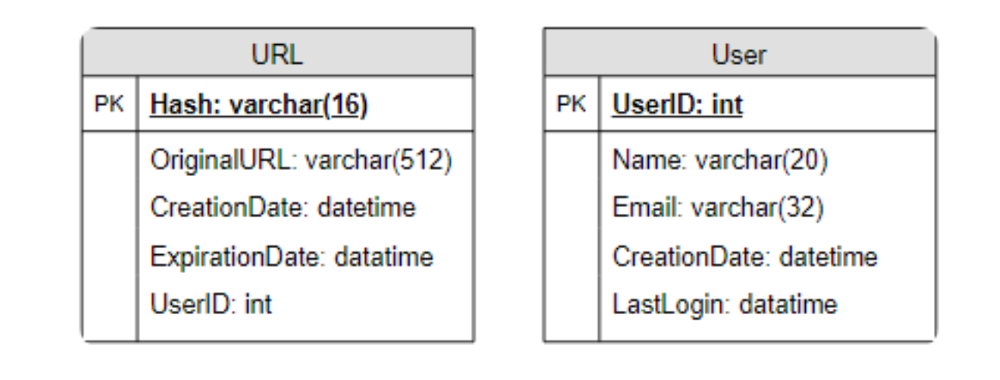
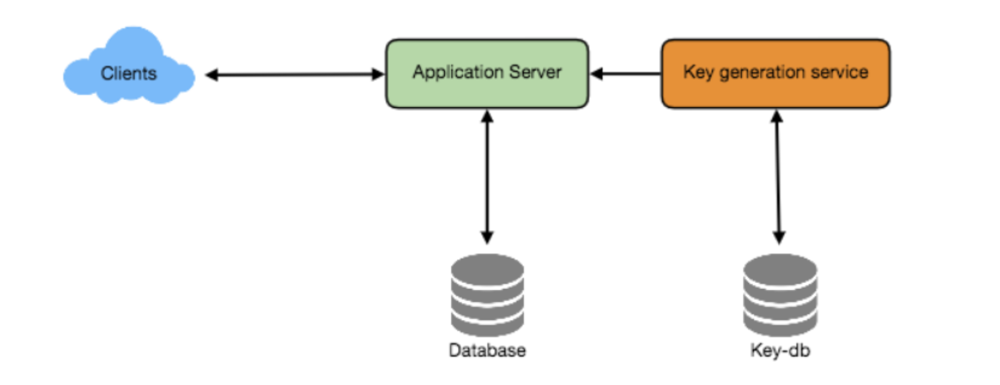
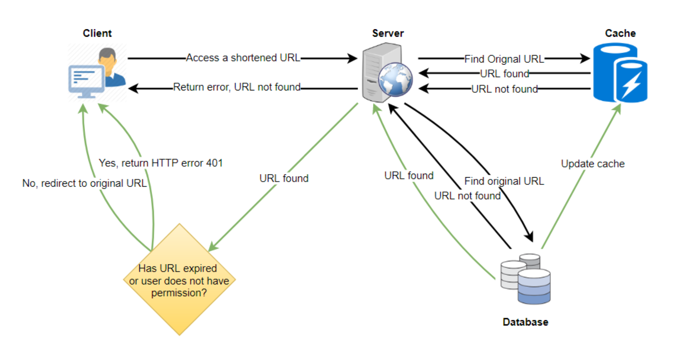
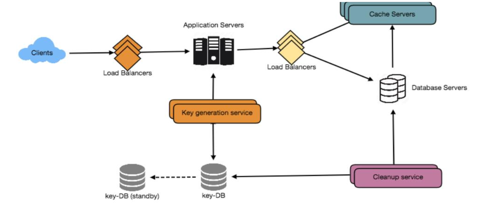

## Why do we need tiny url?

- Short links save a lot of space when displayed, printed, messaged, or tweeted.
- URL shortening is used for optimizing links across devices.
- Tracking individual links to analyze audience and campaign performance.

## Requirements

### _Functional_

- Given a URL, service should generate a shorter and unique alias of it. This is called a short link.
- When users access a short link, service should redirect them to the original link.
- Users should optionally be able to pick a custom short link for their URL.
- Links will expire after a standard default time span. Users should be able to specify the expiration time.

### _Non-Functional_

- The system should be highly available, otherwise all redirections will start failing.
- URL redirection should happen in real-time with minimal latency.
- Shortened links should not be guessable (not predictable).

### _Extended requirements_

- Analytics; For ex, how many times a redirection happened?
- The service should also be accessible through REST APIs by other services.

## Back of the envelope estimation

- The system will be read-heavy. Let’s assume 100:1 ratio between read and write
- Assume 500 million create requests per month.

### _Traffic estimates_

```
No of redirections per month 100 * 500M = 50Billion
No of queries per sec 500 * 1000000 / (30 * 24 * 60 * 60 ) = 200 per sec(approx)
No of redirections per sec = 200 * 100 = 20K per sec 
```

### _Storage estimates and memory estimate_

- Storage refers to disk and memory refers to cache.
```
No of objects to be stored for 5 years = 500M * 12 * 5 = 30000M = 30B objects
If each object is about 500 bytes, total storage = 30B * 500Bytes = 15000B bytes = 15Trillion bytes = 15TB
Take 20/80 ratio and cache refreshes on daily basis = 20K * 86400seconds * 0.2 * 500Bytes 
                        = 1740000K * 100B = 1740M * 100B = 174000 MB = 174 GB   
```

### _Bandwidth estimates_

```
Read bandwidth = 20k/s * 500B = 10000 kb/s = 10 mb/s
Write bandwidth = 200/s * 500B = 100000 b/s = 100 kb/s
```

## Api design

- The system needs 3 main apis create, get and delete.

```
String createURL(api_dev_key, original_url, custom_alias, user_name, expire_date)
String getURL(user_name, tiny_url)
void deleteURL(user_name, tiny_url)
```
- `Note:` api_dev_key is used to prevent abuse by limiting no of create requests/redirections per user.

## Database design

- `Considerations`
  - Need to store billions of records
  - Each object is small(less than 1k)
  - No relationship between records(except storing info about user and created URL)
  - Service is read-heavy



- `Choosing DB`
  - `RDBMS:` A relational database (RDBMS) is a good choice if the expected load is low and there is no need for 
    high scalability. So, RDBMS is not considered for tinyURL because of scalability requirements.
  - `MongoDB:` MongoDB is a document-oriented database that is easy to use and scale. 
    - It is a good choice if the long and short URLs are stored as documents.
  - `Cassandra:` Cassandra is a distributed database that is designed to handle high loads.
    - It is a good choice if the system is expected to handle many requests.
- `Conclusion`
  - The system can choose either MongoDB or Cassandra.

## High level design

- It is a simple high-level design, so writing down the steps.
  - `create URL`
    - user sends a request to the app server for creating tinyURL
    - App server creates a random string and saves the record in the DB table.
    - App server returns the tinyURL.
  - `Get URL`
    - Client clicks on the tinyURL and app server receives the request
    - App server fetches the original URL from the DB.
    - App server sends the response with original URL in the header with status code of 301 or 302(not to cache).

## Low level design

### _App server_

- `Encoding actual URL`
  - Compute a unique hash of the given URL using either MD5 or SHA256.
  - Encoding usually done with base64([a-z,A-Z,0-9]), `-` and `.`.
  - MD5 generates 128 bit hexadecimal value. Each char in hexadecimal takes 4 bits. so total 32 characters.
    Each base64 character encodes 6 bits, so we get 22 characters(21*6 = 126).
  - SHA256 generates 256 bit hexadecimal value. so total 64 characters. For base 64, we get 43 chars.
  - For the system requirement of 30 Billion URLs for 5 years, we require 6 characters. 64<sup>6</sup> = 68.7billion.
  - Truncating MD5 or SHA256 encoded value to 6 chars will work.
- `Issues with encoding`
  - Truncating results in key duplication.
  - If multiple users enter the same URL, they get same shortened URL.
  - Handling URLs that are already encoded is difficult with the chosen encoding.  
- `Solutions`
  - `Increasing sequence`
    - Append an increasing sequence number to each input URL to make it unique, and then generate a hash of it.
      - No need to save the sequence in DB, because we don't need that while fetching.
      - `Problem:` Ever-increasing sequence number can cause overflow and impact performance also.
  - `Append userid`
    - append user id to the input URL.
    - `Problems:` 
      - If user is not signed, this won't work.
      - If there are duplicates, again need to go with increase the sequence.
  - `Generating keys offline`
    - A standalone Key Generation Service (KGS) that generates random six letter strings beforehand.
    - Store the keys in a database and ensure no duplicates.
    - When a request comes for creation, a key is fetched from already generated keys.
    - `Advantages`
      - No need to worry about duplicates
      - No need to encode URLs
    - `Considerations`
      - `How to handle concurrent requests from app server to KGS`
        - KGS can use two tables: one for already used keys and another for not used.
        - As soon as keys are given to one of the app servers, move them to used keys table.
        - KGS can load some keys into memory beforehand and move them to used keys table for better performance.
        - If KGS dies before handling the keys to app servers, few keys are wasted. But, that should be fine given
          huge number of keys(68.7B), which is considerably higher than required(30B)
      - `Key DB size`
        - `6(chars) * 68.7B = 412 GB`
      - `Single point of failure`
        - Have a stand-alone replica of KGS.
      - `Cache some keys at app server`
        - Caching some keys at app server by fetching from KGS improves performance.
        - If an app server dies, then few keys will be wasted. But, that should be acceptable since we have 68.7B keys.
      - `Performing key lookup`
        - If key is present in DB send a 302 redirect status back to the browser by passing stored URL in the location
          header.
        - If key is not present send a 404 status or redirect back to the home page.
- The below program generated 1 million keys in .35 seconds. 

```python
def generate_random_string(n):
    letters = "abcdefghijklmnopqrstuvwxyzABCDEFGHIJKLMNOPQRSTUVWXYZ0123456789"
    used_strings = set()

    while len(used_strings) < n:
        string = ''.join(random.choice(letters) for _ in range(6))
        if string not in used_strings:
            used_strings.add(string)
            yield string
```



### _Data partitioning and replication_

- DB needs to be scaled for storing billions of URLs.
- Scaling requires a partitioning scheme to store data to different DB servers.
  - `Range based partitioning`
    - Store URLs based on the first letter of the hash key.
    - Some less frequently letters can be combined.
    - `Problems`
      - Can lead to unbalanced servers due to hotspots.
  - `Hash based partitioning`
    - Calculate the hash of key to determine the partition.
    - This approach can still lead to hotspot especially when servers are added and removed.
    - The solution for the hotspots is to use `consistent-hasing`.

### _Cache_

- The system can use Memcache or redis, which can store full URLs with their respective hashes.
- The application servers, before hitting backend storage, can quickly check if the cache has the desired URL.
- As cache requires 170 GB, most modern servers support 256 GB, all the data can fit in one server.
  - Alternately, we can use a couple of smaller servers for better read throughput.
- `Cache eviction policy`
  - Least Recently Used (LRU) can be a reasonable policy for this system.
    - For custom-built caches, using a data structure like linked hash map can achieve this.
    - For systems like memcached and redis, various configuration options are provided to choose LRU.
- `Handling cache miss`
  - Whenever there is a cache miss, app servers would be hitting a backend database.
  - Update the cache and pass the new entry to all cache replicas.
  - Each replica can update their cache by adding the new entry.



### _Load balancer_

- Load balancing layer can be placed at three places in the system:
  - Between client and app servers
  - Between app servers and database servers
  - Between app servers and cache servers
- Strategies
  - `round-robin`
    - Simple to implement and doesn't introduce over head.
    - Doesn't take server load into consideration.  
  - `weighted round-robin`
    - Server load is taken into consideration before sending request to a server.
    - Puts over head on the load balancer.
- Other strategies like least connection, least response time, iphash etc.

### _DB cleanup_

- If a user specified expiration time or default expiration time is reached, entries should be removed from DB.
- A backend process(cleanup service) should make sure that expired links are removed.
- After removing the expired links, the keys should be put back into key db.

  

### _Security and Permissions_

- Private URLs can be created to allow access to certain users.
- There are two ways to this.
  - Store permission level (public/private) with each URL in the database.
  - Create a separate table to store UserIDs that have permission to see a specific URL.
    - Storing the data in a column wide DB like cassandra with key is the hash and columns are the list of userIds
      which have access.
- If a user does not have permission and tries to access a URL, send an error (HTTP 401) back.      

## Questions?

- How do you handle custom aliases?
