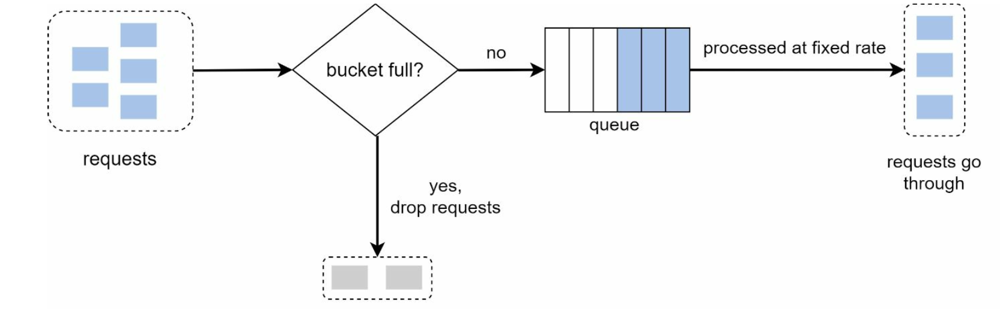

## What is a rate limiter?

- A rate limiter is used to control the rate of traffic sent by a client or a service over a specific period.
- If the request count exceeds the threshold defined by the rate limiter, all the excess calls are blocked. For ex,
  - A user can write no more than 2 posts per second.
  - Create a maximum of 10 accounts per day from the same IP address.
  - Claim rewards no more than 5 times per week from the same device.  
- `Benefits`
  - `Prevent resource starvation caused by Denial of Service (DoS) attack.` For ex:
    - Twitter limits the number of tweets to 300 per 3 hours.
    - Google docs APIs limit 300 per user per 60 seconds for read requests.
  - `Reduce cost`
    - Limiting excess requests means fewer servers and allocating more resources to high priority APIs.
    - Rate limiting is extremely important for companies that use paid third party APIs.
  - `Revenue`
    - Certain services might want to limit operations based on the tier of their customer’s service and thus create 
      a revenue model based on rate limiting.
  - `Prevent servers from being overloaded`
    - A rate limiter is used to filter out excess requests caused by bots or users’ misbehavior.
- A rate limiter is a process by which rate and speed can be configured.
- Throttling is the process of controlling the usage of APIs by clients during a specific time period.
- Types of throttling
  - `Hard throttling`
    - The number of API requests cannot exceed the throttle limit.
  - `Soft throttling`
    - The API request limit can exceed a certain percentage. For ex, if rate limit is 100 req/sec and 10% exceed limit,
      rate limiter will allow up to 110 req/sec.
  - `Elastic or Dynamic throttling`
    - The number of requests can go beyond the threshold if the system has some resources available.

## Requirements

### _Functional_

- Limit the number of requests an entity can send to an API within a time window. For ex, 15 req/sec.
- The rate limit should be considered across different servers. It means rate limit applies for a single server or
  across combination of servers.

### _Non functional_

- The system should be highly available.
- The system should have minimum latency.
- The system should show clear exceptions to users when the requests are throttled.
- The system should be highly fault-tolerant. If there is a problem with rate limiter, it should not impact the entire
  system.

## High level design

- Rate limiter is usually implemented within a component called API gateway.
- API gateway is a fully managed service that supports rate limiting, SSL termination, authentication, 
  IP whitelisting, servicing static content, etc.
- Rate limiter throttles requests to APIs as shown below. For ex, if a service allows 2 req/sec and if it receives a 
  third req with in a sec, rate limiter returns a 429 http status code.
  


- `Custom middleware`
  - we can also write custom middle ware.
  - The counters can be stored in an in-memory cache like redis, as sql dbs are slow due to disk access.
  - Redis is a popular option to implement rate-limiting. It offers commands like INCR and EXPIRE.
    - INCR: Increments the stored counter by 1
    - EXPIRE: sets a timeout for the counter. Counter will be deleted if the timeout expires.

  

## Rate limiting algorithms

- Rate limiting can be implemented using different algorithms, and each of them has distinct pros and cons.
- Here is a list of popular algorithms:
  - Token bucket
  - Leaking bucket
  - Fixed window counter
  - Sliding window log
  - Sliding window counter

### _Token bucket_

- It is widely used for rate limiting. 
- It is simple, well understood and commonly used by companies like Amazon, stripe etc.
- A token bucket is a container that has pre-defined capacity.
- Tokens are put in the bucket at preset rates periodically.
- Once the bucket is full, no more tokens are added.
- `Flow`
  - Each request consumes one token.
  - When a request arrives, 
    - If there is a token available in the bucket, request goes through.
    - If there is no token, requests are either dropped or queued.
- The token bucket algorithm takes two parameters:
  - Bucket size: Max no of tokens allowed in the bucket
  - Refill rate: rate(secs or minutes) at which tokens are put.
- `How many buckets are required?`
  - This varies based on rate limiting rules. For ex:
    - It is necessary to have different buckets for different apis. For ex:
      - 10 create api requests per sec per user
      - 100 read api requests per sec per user
  - If throttling is based on IP addresses, each IP address requires a bucket.
  - If system allows a max requests per sec, then it makes sense to have a global bucket shared by all.
- `Pros`
  - Easy to implement
  - Memory efficient
  - Token allows burst of traffic as long as tokens are left.
    - `Note:` Burst of traffic makes sense when this algorithm is used for network traffic management. It doesn't make
      any difference for no of API requests.
- `Cons`
  - Bucket size and refill rate might be challenging to tune the rate limiter properly.


```python
class TokenBucket:
    def __init__(self, capacity, rate):
        self.capacity = capacity
        self.rate = rate
        self.tokens = capacity
        self.last_update_time = time.time()

    def allow(self):
        current_time = time.time()
        # No of tokens to be added since last updated time
        tokens_added = (current_time - self.last_update_time) * self.rate
        # If no of tokens are beyond capacity, then assign it to capacity
        self.tokens = min(self.capacity, self.tokens + tokens_added)
        self.last_update_time = current_time
        
        if self.tokens > 0:
            self.tokens -= 1
            return True
        else:
            return False

# Example usage:

token_bucket = TokenBucket(100, 10)

# Try to allow a request.
if token_bucket.allow():
    # The request is allowed.
else:
    # The request is dropped.
```

### _Leaking bucket_

- This is similar to token bucket except requests are processed at fixed intervals.
- It is usually implemented with FIFO queue.
- `Flow`
  - When a request arrives 
    - If the queue is not full, the request is added to the queue.
    - If the queue is full, the request is dropped.
  - Requests are pulled from the queue at regular intervals(like 1 sec, 1 min etc).

  

- Leaking bucket algorithm takes two parameters.
  - `Bucket size:` It is equal to the queue size.
  - `Outflow rate:` It defines how many requests can be processed at a fixed rate.
- `Pros`
  - Memory efficient
  - Suitable for use cases that requires a stable outflow rate.
- `Cons`
  - A burst of traffic fills up the queue and new requests are dropped.
  - Two parameters are not easy to tune.

```python
class LeakyBucket:
    def __init__(self, rate):
        self.rate = rate
        self.tokens = 0

    def allow(self):
        # assign no of tokens (starting from 0) until it reaches the rate
        self.tokens = min(self.rate, self.tokens + 1)
        if self.tokens > 0:
            self.tokens -= 1
            return True
        else:
            return False

# Example usage:

leaky_bucket = LeakyBucket(10)

# Try to allow a request.
if leaky_bucket.allow():
    # The request is allowed.
else:
    # The request is dropped.
```  

### _Fixed window counter_

- The algorithm divides the timeline into fix-sized time windows and assign a counter for each window.
- `Flow`
  - Each request increments the counter by one.
  - Once the counter reaches the pre-defined threshold, new requests are dropped until a new time window starts.
- Let's take an example to understand this flow.
  - Let's assume rate limiter is allowing three requests per minute per user.
- Implementation of fixed window counter is very simple. For ex, let's assume our rate limiter limits 
  10 req/sec per user.
  - we can use hash table(key=userId, value=count)
  - If userId is not in hash table set count = 10 and startTime = currentTime.
  - If userId is present in the hash table
    - If currentTime - startTime >= 1 sec, set count = 10
    - If currentTime - startTime <= 1 sec
      - if count < 10, increment count.
      - if count >= 10, reject the request.
- `Memory estimates`
  - The key in the hash table userId takes 8 bytes.
  - The value object contains count and startTime
    - count takes 2 bytes
    - startTime takes 2 bytes(out of 4 bytes epoch time consider only minutes and seconds)
  - overhead(metadata like linked list, array size and load factor) of 20 bytes for each entry.
  - Memory required for an entry is 8 + 2 + 2 + 20 = 32 bytes.
  - For 1 million users, it takes 32mb.
- It can easily fit in a single server, but to accommodate 10 million req/sec(10 req/sec/user) it is better to have
  multiple servers for high availability.

```python
class FixedWindowCounter:
    def __init__(self, window_size):
        self.window_size = window_size
        self.window = [0] * window_size
        self.current_index = 0
        self.count = 0

    def increment(self):
        # Update the count for the current window
        self.window[self.current_index] += 1
        # Increment the overall count
        self.count += 1
        # Move to the next index in the window
        self.current_index = (self.current_index + 1) % self.window_size

    def get_count(self):
        return self.count

    def get_window_counts(self):
        return self.window

# Example usage:
window_size = 5
counter = FixedWindowCounter(window_size)

# Increment the counter multiple times
for _ in range(8):
    counter.increment()

# Get the overall count
print("Overall count:", counter.get_count())

# Get the counts within the window
print("Window counts:", counter.get_window_counts())

```  
- `Pros`
  - Memory efficient
  - Easy to understand
  - 
- `Cons`
  - A spike in traffic at the edges of time windows could cause more requests than allowed quota to go through.
  - `Race condition:` Two separate processes read the counter may get same value.
    - Use either custom implementation for locking or redis lock. 

### _Sliding window log_

- To maintain a sliding window each request needs to be tracked.
- To store timestamp for each request a sorted set in the value field. For ex:
  `kristie: {1499818000,1499818500,1499818800}`
- Let's see an example of 10 req/sec/user.
  - when a new request comes it is added to the map with userId as key and value as sorted set with current time entry.
  - If a request comes for an existing user
    - remove all timestamps that are older than 1sec(currentTime - 1sec)
    - count the total no of elements in the set.
      - If no of elements in the sorted set are greater than 10, reject the request.
      - If no of elements in the sorted set are less than 10, then insert the current time in the sorted set.
- `Memory estimates`
  - Suppose we need to restrict 500 req/min/user.
  - userId takes 8 bytes
  - epoch time takes 4 bytes + 20 bytes for sorted set overhead
  - Memory required for an entry is 8 + (4 + 20)*500 = 8 + 24 * 500 = 12000bytes = 12 kb
  - For 1 million users it takes 12kb * 1M = 12 GB.
  - Sliding window log takes 32 GB, which is very high compared to 32 MB of fixed window counter.
- `Pros`
  - Rate limiting implemented using this method is accurate during any time window.
- `Cons`
  - The algorithm consumes a lot of memory.

### _Sliding window counter_

- Sliding window counter is a hybrid version of sliding window and fixed window counter.
- Let's consider an example of rate limiting of 500 req/min/user.
  - This has a rate limit setting of 500 req/min and also an additional limit of 10 req/sec.
- This additional rate-limit of 10 req/sec throttles per second.
- This ensures that if sum of all counters with timestamp for past one minute should not exceed 500.
- This reduces the memory consumption.
- `Memory usage`
  - userId 8 bytes
  - timestamp 4 bytes
  - counter 2 bytes
  - overhead of 20 bytes (hash table)
  - No of second counters per min = 60  
  - Memory for a user is 8 + (4 + 2 + 20) * 60 = 1.6 KB
  - Total memory for 1 million = 1.6 GB
- This consumes 86% less memory than sliding window.

## Component design

### _Defining rate limiting rules_

- Rate limiting rules are typically defined in configuration files like json, yaml etc and save on to disk.
- We will examine the configurations of an open source rate limiting software `Lyft`.
```yaml
domain: messaging 
descriptors:
  - key: message_type 
    Value: marketing 
    rate_limit:
      unit: day 
      requests_per_unit: 5
```
```yaml
domain: auth 
descriptors:
  - key: auth_type 
    Value: login 
    rate_limit:
      unit: day 
      requests_per_unit: 5
```
- The first configuration defines a rate limit of 5 marketing messages per day, whereas the second one defines a rate
  limit of 5 login attempts per min.

### _Exceeding rate limit_

- Rate limited requests can be rejected with 429 status code or enqueued to process later.
- If some requests are rate limited due to system load, they can be enqueued.
- A client knows about rate limiting information through headers.
- `Rate limit headers`
  - `X-Ratelimit-Remaining`: The remaining number of allowed requests within the window. 
  - `X-Ratelimit-Limit`: It indicates how many calls the client can make per time window.
  - `X-Ratelimit-Retry-After`: The no of seconds to wait until a request can be tried without being throttled.

### _Detailed design_

- Rules are stored on disk.
- Workers frequently pull rules from disk and store them in cache.
- `Flow`
  - When a request is received by rate limiter middleware
    - Load rules from cache
    - Fetches count and last timestamp from redis cache
    - If request is not rate limited, forwarded to api servers.
    - If request is rate limited, then 429 response.
      - Meanwhile, request is either dropped or enqueued.

  

### _Distributed environment_

- Building rate limiter presents two challenges.
  - Race condition
    - Two threads read the same counter value and update at the same time.
    - `Solution`  
      - Locks are the most obvious solution, but they slow down the system.
      - Other solutions for this are Lua scripts and sorted sets data structure.(TODO)
  - Synchronization issue
    - Single rate limiter server cannot handle millions of requests.
    - Multiple rate limiter servers require synchronization.
      - Synchronization plays a key role if state is handled.
      - Can use sticky sessions such that requests from same client are routed to same server.
      - `Drawbacks`
        - This approach is neither scalable nor flexible.
    - Using a centralized data source like redis is the best choice.

  

### _Performance optimization_

- Multi-data center setup is crucial for a rate limiter because latency is high for users located far away from 
  the data center.
- Two steps are required to improve optimization.
  - `Edge servers`
    - Most cloud service providers build many edge server locations around the world.
    - For ex, Cloudflare has 194 geographically distributed edge servers as of 2020.
  - `Eventual consistency`
    - Synchronize data with an eventual consistency model.
  
### _Monitoring_

- It is important to gather analytics data to check whether the rate limiter is effective.
- Ensure the following.
  - The rate limiting algorithm is effective.
  - The rate limiting rules are effective.
  
### _Rate limiting by Ip or User_

- `IP`
  - Throttle requests by IP is not efficient because multiple users share same public ip.
    - One bad user can cause throttling to others.
- `User`
  - User is provided with a token(api_dev_token), which the user passes with every request.
  - This won't work for rate-limit on login api because a hacker can perform DOS attack by entering wrong credentials. 
- `Hybrid`
  - The best approach is to combine both Ip and User token.
  
## Questions

- what are lua scripts and sorted sets?
