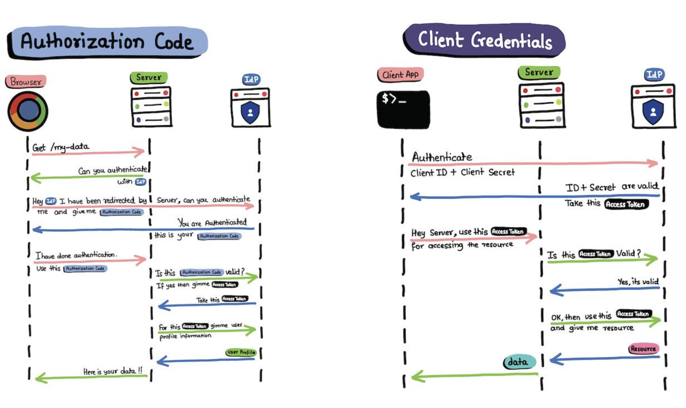
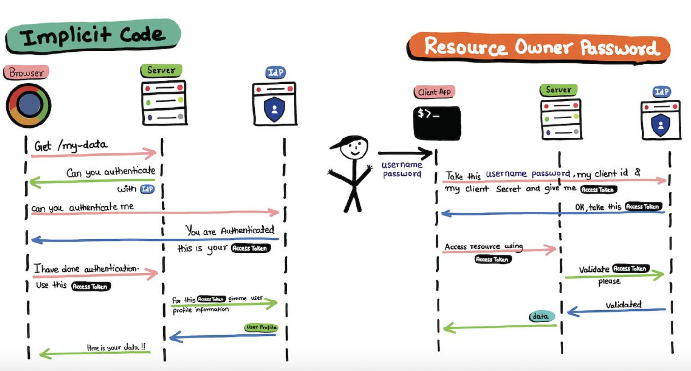

# OAUTH flows

- `Authorization Code Flow:` The most common OAuth flow. After user authentication, the client receives an authorization code and exchanges it for an access token and refresh token.
- `Client Credentials Flow:` Designed for single-page applications. The access token is returned directly to the client without an intermediate authorization code.
- `Implicit Code Flow:` Designed for single-page applications. The access token is returned directly to the client without an intermediate authorization code.
- `Resource Owner Password Grant Flow:` Allows users to provide their username and password directly to the client, which then exchanges them for an access token.

